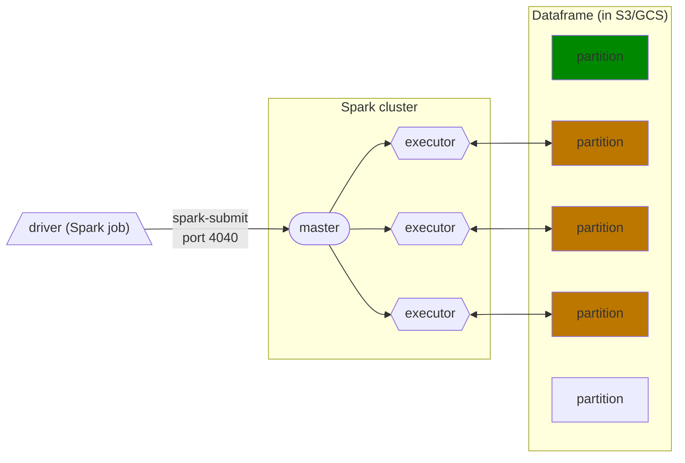

# Week 5 Notes
By Chekwei Chia

## Batch Processing vs Stream
Batch
- processing chunks of data at regular intervals
- calculating trips revenue at end of each month

Stream
- as the name suggests, process a set of data as soon as it's being received or generated.

## Pros and Cons of Batch Processing
Pros
- Jobs can be retried after they have failed
- Use Spark, which can run in bigger clusters and hence make things more scalable

Cons
- since we process the data in regular intervals, they are not "live", hence we need to wait for the next interval if we want to see "real time" results


## To setup Spark

Check out running Spark with docker [here](https://maxmelnick.com/2016/06/04/spark-docker.html)

```python
import pyspark
from pyspark.sql import SparkSession

spark = SparkSession.builder \
    .master("local[*]") \
    .appName('test') \
    .getOrCreate()

spark.version
```

Below credits to [Alvaro Navas](https://github.com/ziritrion/dataeng-zoomcamp/blob/main/notes/5_batch_processing.md): 

- SparkSession is the class of the object that we instantiate. builder is the builder method.
  
- master() sets the Spark master URL to connect to. The `local` string means that Spark will run on a local cluster. [*] means that Spark will run with **as many CPU cores as possible**.
  
- appName() defines the name of our application/session. This will show in the Spark UI.
  
- getOrCreate() will create the session or recover the object if it was previously created.

## To read a .csv file
```python
df = spark.read \
    .option("header", "true") \
    .csv('fhvhv_tripdata_2021-01.csv')
```
`option()` contains options for the read method. In this case, we're specifying that the first line of the CSV file contains the column names.

## To print the schema
```python
df.printSchema()
```
Will return below, for example:
```bash
root
 |-- hvfhs_license_num: string (nullable = true)
 |-- dispatching_base_num: string (nullable = true)
 |-- pickup_datetime: timestamp (nullable = true)
 |-- dropoff_datetime: timestamp (nullable = true)
 |-- PULocationID: integer (nullable = true)
 |-- DOLocationID: integer (nullable = true)
 |-- SR_Flag: string (nullable = true)
```

## To select certain features of the DF
Here we are selecting few features, and then filter by license number.

Remember to include `.show()` in order to "print" the results.

```python
df.select("pickup_datetime", "dropoff_datetime", "PULocationID", "DOLocationID") \
  .filter(df.hvfhs_license_num == "HV0003").show()
```

## To create temp tables
```python
df_trips_data.registerTempTable('trips_data')
```
After that, we can run SQL on `trips_data` table.

```SQL
spark.sql("""
SELECT
    service_type,
    count(1)
FROM
    trips_data
GROUP BY 
    service_type
""").show()
```

## How Sparks work?
A Spark cluster is composed of **multiple executors**. Each executor can process data independently in order to parallelize and speed up work. Each executor can be thought of like a "computer" and will do the computational. 

If we were to read a single large `.csv` file, it will only be read and processed by a single executor. The rest of the executors will have nothing to do, and they will be wastefully idle. 

If we divide the files into "separate partitions", each of the partitions can then be processed by each executor within the Spark cluster. 

```python
# create 24 partitions in our dataframe
df = df.repartition(24)

# parquetize and write to fhvhv/2021/01/ folder
# we will eventually see 24 parquet files in this folder
df.write.parquet('fhvhv/2021/01/', mode="overwrite")
```
Also, bear in mind that we will see a `_SUCCESS` created in the directoy, which is a flag/marker that tells us the Spark job has completed. 

`mode="overwrite"` will allow us to overwrite the parquet files into the directory, if there were presence of files within.

## Actions vs Transformations
Transformations (lazy) not executed immediately
- selecting columns
- filtering
- join, group by, order

Actions (eager) executed immediately
- show
- head, take
- write

## Spark Internals
Below credits to [Alvaro Navas](https://github.com/ziritrion/dataeng-zoomcamp/blob/main/notes/5_batch_processing.md): 

