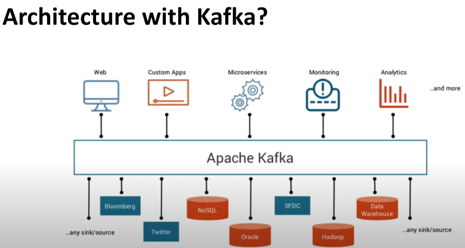
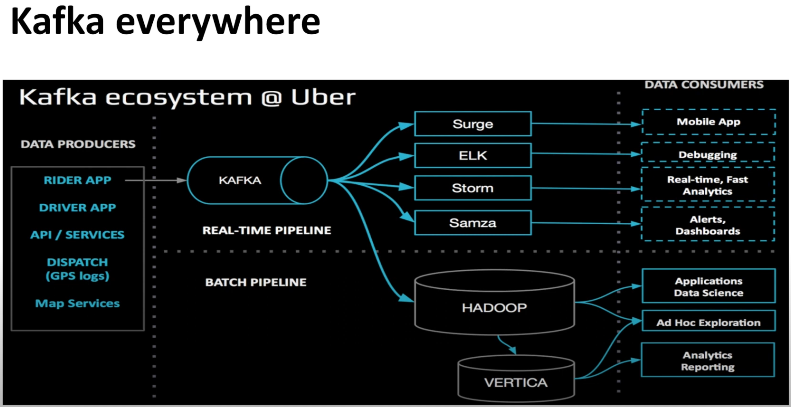
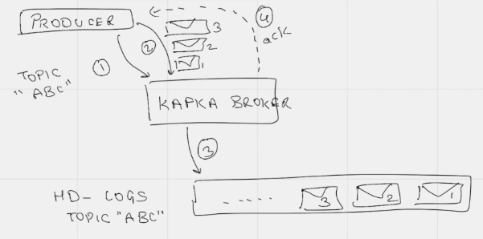
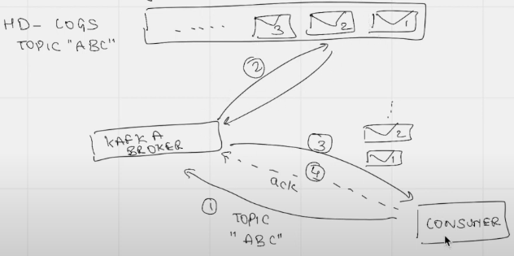
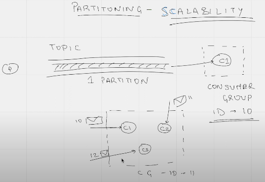
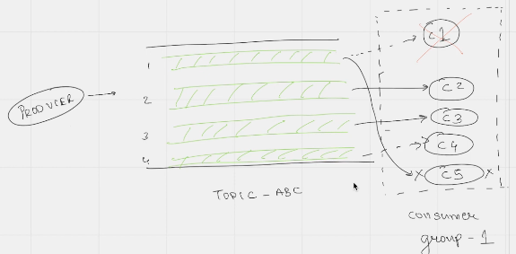
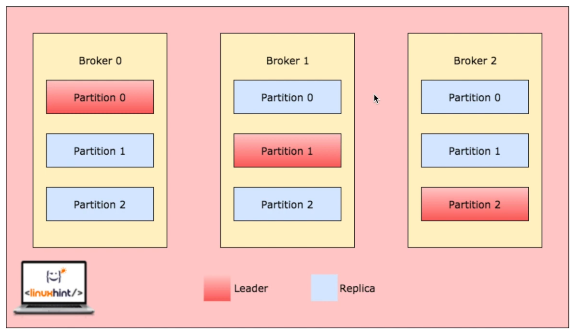

# Week 6 Notes
By Chekwei Chia

# Streaming/Kafka



- data sources/sinks (bottom half of the pic) are talking directly to apache kafka and pushing messages as soon as they receive anything
- basically, messages are always available at kafa
- the consumers or producers basically read the messages from kafka, and if they have anything to publish, they will also write to kafka
    - those messages will either be stored in sink (eg. nosql)
    - or can be directly consumed by another service, for example when an web app publishes a message, the micro services can EITHER read it from nosql, or real time directly from kafka (as such, micro services will get immediate notification that something is ready to be read)
        
        



for real time pipeline, we can see that those technologies connect directly to kafka and then sends it to the data consumers

- the kafka acts as a message broker, or service in between the producers and consumers

## Kafka Message

- push message, pull message
- message consist of key, value, timestamp

## Topic in kafka

- producer pushes msg to a topic
    - in turn, consumer will consume msg from that same topic
- topic is an abstraction layer
    - if we want to push diff msg, we can create diff topics
        - Eg. Sales, Return, Order
        - Each concept has its own topic, generally name it such that it makes sense

## Kafka broker

- broker - physical machine on which kafka is running
- cluster - multiple kafka brokers (multiple machines working altogether)

## Logs

- data segment/physical hdd representation
- assigns sequence ID to each message before storing in logs

## The Flow of Kafka (Producer)



- ***Step 1***: whenever producer wants to talk to kafka broker, it will tell the topic name first
    - introduces the topic: “ABC” to kafka
- which will result in kafka broker assigns a physical location/segment for this topic on the hard disk
- ***Step 2***: producer will start sending messages to kafka broker - message 1, 2, 3
- ***Step 3***: these messages are physically written to the logs itself, and this is represented on the hdd
- ***Step 4***: once these messages are written, kafka broker sends an ACK back to the producer to tell it that everything has been written

## The Flow of Kafka (Consumer)



- ***Step 1***: consumer will talk to the same kafka broker, by first telling it that it wants to read from topic ABC
- ***Step 2***: kafka will go to the logs (physical hard disk segment), pull all those messages which belong to topic ABC
- ***Step 3***: pushing those messages 1, 2, 3 to the consumer
- ***Step 4***: once consumer has received and read those messages, it will send an ACK to kafka broker

## Consumer offset (internal topic)

- a form of logging to keep track which consumer has read what/which messages alrd
- in case a consumer dies, it will know what’s the latest msg it has alrd read

## Partitioning

- diff concept as BigQuery or data warehouse
- here, partitioning is a form of scalability
- generally a topic is a wrapper around a partition



## Consumer Group

- within each CG, we can have multiple consumers
- allows us to horizontally scale the consumers
- ***kafka treats all consumers within the SAME CG as same entity***
    - within the same CG, if consumer 1 receives msg=10, consumer 2 will NOT receive msg=10
    - consumer 2 can proceed to receive msg=11
    - consumer 3 can proceed to receive msg=12

## Maximum scalability



that’s when the number of partitions within a topic, is same number as number of consumers within the same CG

- any extra consumers, there will be no partitions being assigned to it, so the extra consumer will now stay idle
- if one of the existing consumer dies, then this extra consumer will STEP UP and start consuming a partition

## Concept of hash keys

- same key will go to the same partition, which also means same consumer
- internal key table

## Replication in kafka (fault tolerance)

- we have diff brokers (replicas) within a kafka cluster
    - and within each broker, we can have diff partitions 0, 1, 2
- when a msg is being written to a particular topic/partition, those msgs are also being replicated across diff brokers
    
    
    
- if broker 0 dies, then partition 0 which is the leader will die too
    - that’s when either broker 1 or broker 2 for partition 0 will step up as leader
    - if there’s no leader, then producers won’t be able to produce any msgs to the particular topic, similarly consumer wont be able to consume any msgs from the same topic
- when we declare a topic, we can specify replica=2, or 3

## Configuring Consumer

- auto.offset.reset
    - can be set to two values (either earliest, or latest)
    - so when a consumer connects to a kafka broker (or the topic) FOR THE FIRST TIME, the offset does not exist for the particular consumer group
        - as such, kafka cannot determine WHERE DO WE start reading the msgs from
        - so we can set EARLIEST, which means all the msgs that exists in kafka will be read
        - or LATEST, which means all the msgs from now onwards will be read by the kafka consumer

## Configuring Producer

- acks
    - 0 = fire and forget
        - does not wait for the leader or replica broker to write the msg to disk
        - useful when log msgs or monitoring msgs if missed, doesn’t matter. we want speed here, as producer does not have to wait for any ack from the broker
    - 1 = waits for leader broker to write msg to disk
        - only wait for leader broker, as long as receive 1 ack from leader
        - can also miss msg, Eg. leader for that partition writes the msg, but dies immediately and not able to replicate that msg to different replicas
    - all = producer waits for leader and ALL REPLICA to write msg to disk. safest way to write messages. slow, since all msg have to be transferred to replica, have to be written to hdd, and then wait for all ACK (from leader + replica) coming back from kafka

## Adjusting partitions of a topic
Run 

```bash
docker ps
```

To check for CONTAINER ID of the server container (`confluentinc/cp-server:5.4.0`)

Within the server container, run

```bash 
cd /usr/bin

kafka-topics --create --topic demo_1 --bootstrap-server localhost:9092 --partitions 2
```
To see what are the other scripts available, we can run

```bash
ls | grep "kafka"
```